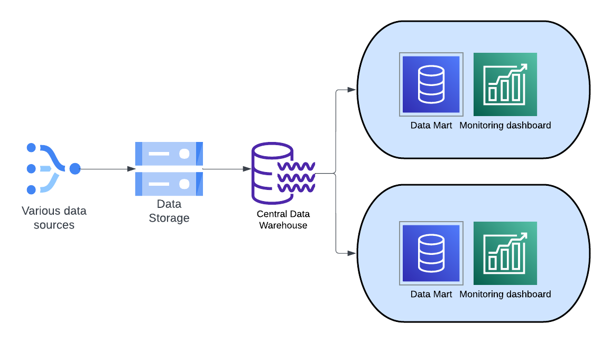

# Introduction to Data Warehousing
## Introduction
In this lesson, we'll introduce the concept of data warehouse and talk about how a well-planned and a well-built data warehouse can help data scientists.

## Objectives
- Learn importance of data warehousing

### What is a data warehouse?
A data warehouse is a central repository of information that can be analyzed to make more informed decisions. Data flows into a data warehouse from transactional, POS (Point of Sale), relational databases, real-time streams, and other sources, most likely on a regular cadence. Data scientists, Business Intelligence engineers, data engineers, and decision makers, like leadership access the data through Business Intelligence tools, like Tableau.

Business users rely on reports and dashboards to extract insights from their data. These metrics are called KPIs (Key Performance Indicators), and they need to be designed in a way to tell the importance about the business performance and support decision making.

### How is a data warehouse architected?
There should be a team of data engineers understanding the business and the various data sources that can land in the central data warehouse. From there, database architects will discuss with each business vertical to decide which data is frequently accessed for each business vertical and design tables or data mart specific for that business vertical.

### Layers of data warehouse
There can be layers of data warehouse. Not all the data that flows into data warehouse is structured at the beginning. The first layer can be raw, and will ingest any upstream data and can be used as a ground source truth that can be replicated. The next layer is the cleaned and can be organized to be more human-readable data. For example, data from POS machines can be byte streams and this can be an example of the first layer data. Data engineers will need to convert this byte stream into a human-readable format for the next layer. Ultimately, the design of layers is up to how the data architects and data engineers decide on based on the efficiency and the resource available to the business. 

### So.. How does a data warehouse tie with data science?
Data science is another business vertical that the data engineers will interact with, and make sure that the data that is used for any data science work is stored in the specific data mart. A data mart is a data warehouse that serves the needs of a specific team or a business vertical, like finance, marketing, or a team of data scientists. It is smaller and more focused for that team. Within each table in a data mart, data is organized into tables and columns. For example, we have loaded a csv file into Pandas, or you can access this kind of tabular data from the tables. You can use the query tool, anything that can support a database connection and querying, or even sqlite CLI tool to access tables and analyze.

### What are the benefits of using a data warehouse as a data scientist?
- Informed decision making, such as the performance of A/B testing
- Consolidated data from many sources
- Historical data analysis
- Data quality

### Data warehouse design for data scientists
As a data scientist, you should be able to assess which data you need to solve the business problem. Not all data you need may be available, and after iterations of discussion, a plan for data warehouse/mart must be laid out for data scientists. Not all data will be in tabular format for data scientists. For example, some applications like big data analytics, full text search, and some machine learning may require data to be in semi-structured or completely unstructured.
Also, a discussion for establishment of KPIs need to be carried out. Usually the KPIs for data scientists require heavy query operations, such as A/B performance over last 60 (or more) days, or repurchase rate of a customer over some long period, etc. KPIs that the data scientist team can measure and constantly improve over needs to be discussed because you will be using these heavy queries frequently. So it would be imperative to have these queries reusable, or have a separate table design to hold these data. We will look over table design, which is data modeling, in next few lessons.

### Summary
A well-thought data warehouse design is essential for the business to run. As the volume and variety of data increases along with business, it's advantageous to have a central data warehouse where all business verticals can and will benefit. From there, the data scientists can carefully design the data warehouse that is specific for data science needs for all data, whether the data is structured or unstructured.

